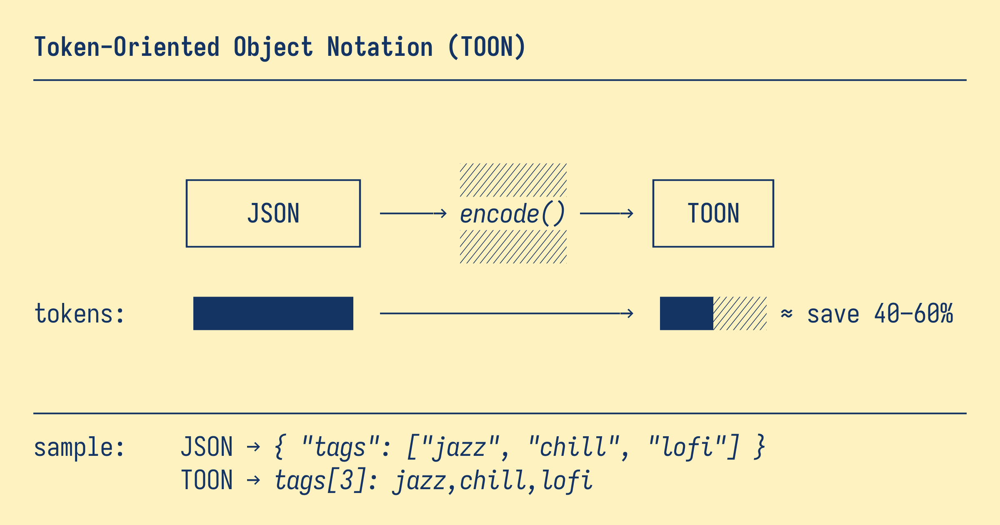

# Token-Oriented Object Notation (TOON)

**Token-Oriented Object Notation** is a compact, human-readable format designed for passing structured data to Large Language Models with significantly reduced token usage. It's intended for LLM input, not output.

TOON excels at **uniform complex objects** – multiple fields per row, same structure across items. It borrows YAML's indentation-based structure for nested objects and CSV's tabular format for uniform data rows, then optimizes both for token efficiency in LLM contexts.

## Why TOON?

AI is becoming cheaper and more accessible, but larger context windows allow for larger data inputs as well. **LLM tokens still cost money** – and standard JSON is verbose and token-expensive:

```json
{
  "users": [
    { "id": 1, "name": "Alice", "role": "admin" },
    { "id": 2, "name": "Bob", "role": "user" }
  ]
}
```

TOON conveys the same information with **fewer tokens**:

```
users[2]{id,name,role}:
  1,Alice,admin
  2,Bob,user
```

<details>
<summary>Another reason</summary>

[](https://xkcd.com/927/)

</details>

## Key Features

- 💸 **Token-efficient:** typically 30–60% fewer tokens than JSON
- 🤿 **LLM-friendly guardrails:** explicit lengths and field lists help models validate output
- 🍱 **Minimal syntax:** removes redundant punctuation (braces, brackets, most quotes)
- 📐 **Indentation-based structure:** replaces braces with whitespace for better readability
- 🧺 **Tabular arrays:** declare keys once, then stream rows without repetition

## Benchmarks

<!-- automd:file src="./benchmarks/results/token-efficiency.md" -->

### Token Efficiency

```
⭐ GitHub Repositories       ██████████████░░░░░░░░░░░   8,745 tokens
                             vs JSON: 15,145  💰 42.3% saved
                             vs XML:  17,095  💰 48.8% saved

📈 Daily Analytics           ██████████░░░░░░░░░░░░░░░   4,507 tokens
                             vs JSON: 10,977  💰 58.9% saved
                             vs XML:  13,128  💰 65.7% saved

🛒 E-Commerce Order          ████████████████░░░░░░░░░     166 tokens
                             vs JSON:    257  💰 35.4% saved
                             vs XML:     271  💰 38.7% saved

─────────────────────────────────────────────────────────────────────
Total                        ████████████░░░░░░░░░░░░░  13,418 tokens
                             vs JSON: 26,379  💰 49.1% saved
                             vs XML:  30,494  💰 56.0% saved
```

<details>
<summary><strong>View detailed examples</strong></summary>

#### ⭐ GitHub Repositories

**Configuration:** Top 100 GitHub repositories with stars, forks, and metadata

**Savings:** 6,400 tokens (42.3% reduction vs JSON)

**JSON** (15,145 tokens):

```json
{
  "repositories": [
    {
      "id": 28457823,
      "name": "freeCodeCamp",
      "repo": "freeCodeCamp/freeCodeCamp",
      "description": "freeCodeCamp.org's open-source codebase and curriculum. Learn math, programming,…",
      "createdAt": "2014-12-24T17:49:19Z",
      "updatedAt": "2025-10-27T07:40:58Z",
      "pushedAt": "2025-10-26T11:31:08Z",
      "stars": 430828,
      "watchers": 8582,
      "forks": 42136,
      "defaultBranch": "main"
    },
    {
      "id": 132750724,
      "name": "build-your-own-x",
      "repo": "codecrafters-io/build-your-own-x",
      "description": "Master programming by recreating your favorite technologies from scratch.",
      "createdAt": "2018-05-09T12:03:18Z",
      "updatedAt": "2025-10-27T07:43:25Z",
      "pushedAt": "2025-10-10T18:45:01Z",
      "stars": 430102,
      "watchers": 6322,
      "forks": 40388,
      "defaultBranch": "master"
    },
    {
      "id": 21737465,
      "name": "awesome",
      "repo": "sindresorhus/awesome",
      "description": "😎 Awesome lists about all kinds of interesting topics",
      "createdAt": "2014-07-11T13:42:37Z",
      "updatedAt": "2025-10-27T07:44:27Z",
      "pushedAt": "2025-10-23T17:26:53Z",
      "stars": 409760,
      "watchers": 8016,
      "forks": 32015,
      "defaultBranch": "main"
    }
  ]
}
```

**TOON** (8,745 tokens):

```
repositories[3]{id,name,repo,description,createdAt,updatedAt,pushedAt,stars,watchers,forks,defaultBranch}:
  28457823,freeCodeCamp,freeCodeCamp/freeCodeCamp,"freeCodeCamp.org's open-source codebase and curriculum. Learn math, programming,…","2014-12-24T17:49:19Z","2025-10-27T07:40:58Z","2025-10-26T11:31:08Z",430828,8582,42136,main
  132750724,build-your-own-x,codecrafters-io/build-your-own-x,Master programming by recreating your favorite technologies from scratch.,"2018-05-09T12:03:18Z","2025-10-27T07:43:25Z","2025-10-10T18:45:01Z",430102,6322,40388,master
  21737465,awesome,sindresorhus/awesome,😎 Awesome lists about all kinds of interesting topics,"2014-07-11T13:42:37Z","2025-10-27T07:44:27Z","2025-10-23T17:26:53Z",409760,8016,32015,main
```

---

#### 📈 Daily Analytics

**Configuration:** 180 days of web metrics (views, clicks, conversions, revenue)

**Savings:** 6,470 tokens (58.9% reduction vs JSON)

**JSON** (10,977 tokens):

```json
{
  "metrics": [
    {
      "date": "2025-01-01",
      "views": 6890,
      "clicks": 401,
      "conversions": 23,
      "revenue": 6015.59,
      "bounceRate": 0.63
    },
    {
      "date": "2025-01-02",
      "views": 6940,
      "clicks": 323,
      "conversions": 37,
      "revenue": 9086.44,
      "bounceRate": 0.36
    },
    {
      "date": "2025-01-03",
      "views": 4390,
      "clicks": 346,
      "conversions": 26,
      "revenue": 6360.75,
      "bounceRate": 0.48
    },
    {
      "date": "2025-01-04",
      "views": 3429,
      "clicks": 231,
      "conversions": 13,
      "revenue": 2360.96,
      "bounceRate": 0.65
    },
    {
      "date": "2025-01-05",
      "views": 5804,
      "clicks": 186,
      "conversions": 22,
      "revenue": 2535.96,
      "bounceRate": 0.37
    }
  ]
}
```

**TOON** (4,507 tokens):

```
metrics[5]{date,views,clicks,conversions,revenue,bounceRate}:
  2025-01-01,6890,401,23,6015.59,0.63
  2025-01-02,6940,323,37,9086.44,0.36
  2025-01-03,4390,346,26,6360.75,0.48
  2025-01-04,3429,231,13,2360.96,0.65
  2025-01-05,5804,186,22,2535.96,0.37
```

</details>

<!-- /automd -->

> [!NOTE]
> Measured with [`gpt-tokenizer`](https://github.com/niieani/gpt-tokenizer) using `o200k_base` encoding (used by GPT-5 and other modern models). Savings will vary across models and tokenizers.

<!-- automd:file src="./benchmarks/results/accuracy/report.md" -->

### Retrieval Accuracy

Accuracy across **3 LLMs** on **159 data retrieval questions**:

```
gpt-5-nano
  toon         ████████████████████  99.4% (158/159)
  yaml         ███████████████████░  95.0% (151/159)
  csv          ██████████████████░░  92.5% (147/159)
  json         ██████████████████░░  92.5% (147/159)
  xml          ██████████████████░░  91.2% (145/159)

claude-haiku-4-5
  toon         ███████████████░░░░░  75.5% (120/159)
  xml          ███████████████░░░░░  75.5% (120/159)
  csv          ███████████████░░░░░  75.5% (120/159)
  json         ███████████████░░░░░  75.5% (120/159)
  yaml         ███████████████░░░░░  74.2% (118/159)

gemini-2.5-flash
  xml          ██████████████████░░  91.8% (146/159)
  csv          █████████████████░░░  86.2% (137/159)
  toon         █████████████████░░░  84.9% (135/159)
  json         ████████████████░░░░  81.8% (130/159)
  yaml         ████████████████░░░░  78.6% (125/159)
```

**Advantage:** TOON achieves **86.6% accuracy** (vs JSON's 83.2%) while using **46.3% fewer tokens**.

<details>
<summary><strong>Performance by dataset and model</strong></summary>

#### Performance by Dataset

##### Uniform employee records (TOON optimal format)

| Format | Accuracy | Tokens | Correct/Total |
| ------ | -------- | ------ | ------------- |
| `toon` | 87.4% | 2.483 | 152/174 |
| `csv` | 82.8% | 2.337 | 144/174 |
| `yaml` | 83.9% | 4.969 | 146/174 |
| `json` | 83.9% | 6.347 | 146/174 |
| `xml` | 88.5% | 7.314 | 154/174 |

##### E-commerce orders with nested structures

| Format | Accuracy | Tokens | Correct/Total |
| ------ | -------- | ------ | ------------- |
| `toon` | 90.9% | 5.967 | 120/132 |
| `csv` | 93.9% | 6.735 | 124/132 |
| `yaml` | 87.1% | 7.328 | 115/132 |
| `json` | 87.9% | 9.694 | 116/132 |
| `xml` | 93.2% | 10.992 | 123/132 |

##### Time-series analytics data

| Format | Accuracy | Tokens | Correct/Total |
| ------ | -------- | ------ | ------------- |
| `csv` | 89.7% | 1.393 | 78/87 |
| `toon` | 88.5% | 1.515 | 77/87 |
| `yaml` | 83.9% | 2.938 | 73/87 |
| `json` | 88.5% | 3.665 | 77/87 |
| `xml` | 85.1% | 4.376 | 74/87 |

##### Top 100 GitHub repositories

| Format | Accuracy | Tokens | Correct/Total |
| ------ | -------- | ------ | ------------- |
| `toon` | 76.2% | 8.745 | 64/84 |
| `csv` | 69.0% | 8.513 | 58/84 |
| `yaml` | 71.4% | 13.129 | 60/84 |
| `json` | 69.0% | 15.145 | 58/84 |
| `xml` | 71.4% | 17.095 | 60/84 |

#### Performance by Model

##### gpt-5-nano

| Format | Accuracy | Correct/Total |
| ------ | -------- | ------------- |
| `toon` | 99.4% | 158/159 |
| `yaml` | 95.0% | 151/159 |
| `csv` | 92.5% | 147/159 |
| `json` | 92.5% | 147/159 |
| `xml` | 91.2% | 145/159 |

##### claude-haiku-4-5

| Format | Accuracy | Correct/Total |
| ------ | -------- | ------------- |
| `toon` | 75.5% | 120/159 |
| `xml` | 75.5% | 120/159 |
| `csv` | 75.5% | 120/159 |
| `json` | 75.5% | 120/159 |
| `yaml` | 74.2% | 118/159 |

##### gemini-2.5-flash

| Format | Accuracy | Correct/Total |
| ------ | -------- | ------------- |
| `xml` | 91.8% | 146/159 |
| `csv` | 86.2% | 137/159 |
| `toon` | 84.9% | 135/159 |
| `json` | 81.8% | 130/159 |
| `yaml` | 78.6% | 125/159 |

</details>

<details>
<summary><strong>How the benchmark works</strong></summary>

#### What's Being Measured

This benchmark tests **LLM comprehension and data retrieval accuracy** across different input formats. Each LLM receives formatted data and must answer questions about it (this does **not** test model's ability to generate TOON output).

#### Datasets Tested

Four datasets designed to test different structural patterns:

1. **Tabular** (100 employee records): Uniform objects with identical fields – optimal for TOON's tabular format.
2. **Nested** (50 e-commerce orders): Complex structures with nested customer objects and item arrays.
3. **Analytics** (60 days of metrics): Time-series data with dates and numeric values.
4. **GitHub** (100 repositories): Real-world data from top GitHub repos by stars.

#### Question Types

159 questions are generated dynamically across three categories:

- **Field retrieval (50%)**: Direct value lookups
  - Example: "What is Alice's salary?" → `75000`
  - Example: "What is the customer name for order ORD-0042?" → `John Doe`

- **Aggregation (25%)**: Counting and summation tasks
  - Example: "How many employees work in Engineering?" → `17`
  - Example: "What is the total revenue across all orders?" → `45123.50`

- **Filtering (25%)**: Conditional queries
  - Example: "How many employees in Sales have salary > 80000?" → `5`
  - Example: "How many orders have total > 400?" → `12`

#### Evaluation Process

1. **Format conversion:** Each dataset is converted to all 5 formats (TOON, JSON, YAML, CSV, XML).
2. **Query LLM**: Each model receives formatted data + question in a prompt and extracts the answer.
4. **Validate with LLM-as-judge**: `gpt-5-nano` validates if the answer is semantically correct (e.g., `50000` = `$50,000`, `Engineering` = `engineering`, `2025-01-01` = `January 1, 2025`).

#### Models & Configuration

- **Models tested**: `gpt-5-nano`, `claude-haiku-4-5`, `gemini-2.5-flash`
- **Token counting**: Using `gpt-tokenizer` with `o200k_base` encoding (GPT-5 tokenizer)
- **Temperature**: 0 (for non-reasoning models)
- **Total evaluations**: 159 questions × 5 formats × 3 models = 2,385 LLM calls

</details>

<!-- /automd -->

## Installation

```bash
# npm
npm install @byjohann/toon

# pnpm
pnpm add @byjohann/toon

# yarn
yarn add @byjohann/toon
```

## Quick Start

```ts
import { encode } from '@byjohann/toon'

const data = {
  user: {
    id: 123,
    name: 'Ada',
    tags: ['reading', 'gaming'],
    active: true,
    preferences: []
  }
}

console.log(encode(data))
```

Output:

```
user:
  id: 123
  name: Ada
  tags[2]: reading,gaming
  active: true
  preferences[0]:
```

## Canonical Formatting Rules

TOON formatting is deterministic and minimal:

- **Indentation**: 2 spaces per nesting level.
- **Lines**:
  - `key: value` for primitives (single space after colon).
  - `key:` for nested/empty objects (no trailing space on that line).
- **Arrays**:
  - Delimiter encoding: Comma delimiters are implicit in array headers (e.g., `tags[3]:`, `items[2]{id,name}:`). Tab and pipe delimiters are explicitly shown in array headers (e.g., `tags[3|]:`, `items[2	]{id	name}:`).
  - Primitive arrays inline: `key[N]: v1,v2` (comma) or `key[N<delim>]: v1<delim>v2` (tab/pipe).
  - Tabular arrays: `key[N]{f1,f2}: …` (comma) or `key[N<delim>]{f1<delim>f2}: …` (tab/pipe).
  - List items: two spaces, hyphen, space (`"  - …"`).
- **Whitespace invariants**:
  - No trailing spaces at end of any line.
  - No trailing newline at end of output.

## Format Overview

### Objects

Simple objects with primitive values:

```ts
encode({
  id: 123,
  name: 'Ada',
  active: true
})
```

```
id: 123
name: Ada
active: true
```

Nested objects:

```ts
encode({
  user: {
    id: 123,
    name: 'Ada'
  }
})
```

```
user:
  id: 123
  name: Ada
```

### Arrays

> [!TIP]
> TOON includes the array length in brackets (e.g., `items[3]`). When using comma delimiters (default), the delimiter is implicit. When using tab or pipe delimiters, the delimiter is explicitly shown in the header (e.g., `tags[2|]` or `[2	]`). This encoding helps LLMs identify the delimiter and track the number of elements, reducing errors when generating or validating structured output.

#### Primitive Arrays (Inline)

```ts
encode({
  tags: ['admin', 'ops', 'dev']
})
```

```
tags[3]: admin,ops,dev
```

#### Arrays of Objects (Tabular)

When all objects share the same primitive fields, TOON uses an efficient **tabular format**:

```ts
encode({
  items: [
    { sku: 'A1', qty: 2, price: 9.99 },
    { sku: 'B2', qty: 1, price: 14.5 }
  ]
})
```

```
items[2]{sku,qty,price}:
  A1,2,9.99
  B2,1,14.5
```

**Tabular formatting applies recursively:** nested arrays of objects (whether as object properties or inside list items) also use tabular format if they meet the same requirements.

```ts
encode({
  items: [
    {
      users: [
        { id: 1, name: 'Ada' },
        { id: 2, name: 'Bob' }
      ],
      status: 'active'
    }
  ]
})
```

```
items[1]:
  - users[2]{id,name}:
    1,Ada
    2,Bob
    status: active
```

#### Mixed and Non-Uniform Arrays

Arrays that don't meet the tabular requirements use list format:

```
items[3]:
  - 1
  - a: 1
  - text
```

When objects appear in list format, the first field is placed on the hyphen line:

```
items[2]:
  - id: 1
    name: First
  - id: 2
    name: Second
    extra: true
```

> [!NOTE]
> **Nested array indentation:** When the first field of a list item is an array (primitive, tabular, or nested), its contents are indented two spaces under the header line, and subsequent fields of the same object appear at that same indentation level. This remains unambiguous because list items begin with `"- "`, tabular arrays declare a fixed row count in their header, and object fields contain `":"`.

#### Arrays of Arrays

When you have arrays containing primitive inner arrays:

```ts
encode({
  pairs: [
    [1, 2],
    [3, 4]
  ]
})
```

```
pairs[2]:
  - [2]: 1,2
  - [2]: 3,4
```

#### Empty Arrays and Objects

Empty containers have special representations:

```ts
encode({ items: [] }) // items[0]:
encode([]) // [0]:
encode({}) // (empty output)
encode({ config: {} }) // config:
```

### Quoting Rules

TOON quotes strings **only when necessary** to maximize token efficiency. Inner spaces are allowed; leading or trailing spaces force quotes. Unicode and emoji are safe unquoted.

> [!NOTE]
> When using alternative delimiters (tab or pipe), the quoting rules adapt automatically. Strings containing the active delimiter will be quoted, while other delimiters remain safe.

#### Keys

Keys are quoted when any of the following is true:

| Condition | Examples |
|---|---|
| Contains spaces, commas, colons, quotes, control chars | `"full name"`, `"a,b"`, `"order:id"`, `"tab\there"` |
| Contains brackets or braces | `"[index]"`, `"{key}"` |
| Leading hyphen | `"-lead"` |
| Numeric-only key | `"123"` |
| Empty key | `""` |

**Notes:**

- Quotes and control characters in keys are escaped (e.g., `"he said \"hi\""`, `"line\nbreak"`).

#### String Values

String values are quoted when any of the following is true:

| Condition | Examples |
|---|---|
| Empty string | `""` |
| Contains active delimiter, colon, quote, backslash, or control chars | `"a,b"` (comma), `"a\tb"` (tab), `"a\|b"` (pipe), `"a:b"`, `"say \"hi\""`, `"C:\\Users"`, `"line1\\nline2"` |
| Leading or trailing spaces | `" padded "`, `"  "` |
| Looks like boolean/number/null | `"true"`, `"false"`, `"null"`, `"42"`, `"-3.14"`, `"1e-6"`, `"05"` |
| Starts with `"- "` (list-like) | `"- item"` |
| Looks like structural token | `"[5]"`, `"{key}"`, `"[3]: x,y"` |

> [!IMPORTANT]
> **Delimiter-aware quoting:** Unquoted strings never contain `:` or the active delimiter. This makes TOON reliably parseable with simple heuristics: split key/value on first `: `, and split array values on the delimiter declared in the array header. When using tab or pipe delimiters, commas don't need quoting – only the active delimiter triggers quoting for both array values and object values.

#### Examples

```
note: "hello, world"
items[3]: foo,"true","- item"
hello 👋 world         // unquoted
" padded "             // quoted
value: null            // null value
name: ""               // empty string (quoted)
text: "line1\nline2"   // multi-line string (escaped)
```

### Tabular Format Requirements

For arrays of objects to use the efficient tabular format, all of the following must be true:

| Requirement | Detail |
|---|---|
| All elements are objects | No primitives in the array |
| Identical key sets | No missing or extra keys across rows |
| Primitive values only | No nested arrays or objects |
| Header delimiter | Comma is implicit in headers (`[N]{f1,f2}`); tab and pipe are explicit (`[N	]{f1	f2}`, `[N|]{f1|f2}`) |
| Header key order | Taken from the first object |
| Header key quoting | Same rules as object keys; keys containing the active delimiter must be quoted |
| Row value quoting | Same rules as string values; values containing the active delimiter must be quoted |

If any condition fails, TOON falls back to list format.

## Type Conversions

Some non-JSON types are automatically normalized for LLM-safe output:

| Input | Output |
|---|---|
| Number (finite) | Decimal form, no scientific notation; `-0` → `0` |
| Number (`NaN`, `±Infinity`) | `null` |
| `BigInt` | Decimal digits (no quotes) |
| `Date` | ISO string in quotes (e.g., `"2025-01-01T00:00:00.000Z"`) |
| `undefined` | `null` |
| `function` | `null` |
| `symbol` | `null` |

Number normalization examples:

```
-0    → 0
1e6   → 1000000
1e-6  → 0.000001
```

## API

### `encode(value: unknown, options?: EncodeOptions): string`

Converts any JSON-serializable value to TOON format.

**Parameters:**

- `value` – Any JSON-serializable value (object, array, primitive, or nested structure). Non-JSON-serializable values (functions, symbols, undefined, non-finite numbers) are converted to `null`. Dates are converted to ISO strings, and BigInts are emitted as decimal integers (no quotes).
- `options` – Optional encoding options:
  - `indent?: number` – Number of spaces per indentation level (default: `2`)
  - `delimiter?: ',' | '\t' | '|'` – Delimiter for array values and tabular rows (default: `','`)
  - `lengthMarker?: '#' | false` – Optional marker to prefix array lengths (default: `false`)

**Returns:**

A TOON-formatted string with no trailing newline or spaces.

**Example:**

```ts
import { encode } from '@byjohann/toon'

const items = [
  { sku: 'A1', qty: 2, price: 9.99 },
  { sku: 'B2', qty: 1, price: 14.5 }
]

console.log(encode({ items }))
```

**Output:**

```
items[2]{sku,qty,price}:
  A1,2,9.99
  B2,1,14.5
```

#### Delimiter Options

The `delimiter` option allows you to choose between comma (default), tab, or pipe delimiters for array values and tabular rows. Alternative delimiters can provide additional token savings in specific contexts.

##### Tab Delimiter (`\t`)

Using tab delimiters instead of commas can reduce token count further, especially for tabular data:

```ts
import { encode } from '@byjohann/toon'

const data = {
  items: [
    { sku: 'A1', name: 'Widget', qty: 2, price: 9.99 },
    { sku: 'B2', name: 'Gadget', qty: 1, price: 14.5 }
  ]
}

console.log(encode(data, { delimiter: '\t' }))
```

**Output:**

```
items[2	]{sku	name	qty	price}:
  A1	Widget	2	9.99
  B2	Gadget	1	14.5
```

**Benefits:**

- Tabs are single characters and often tokenize more efficiently than commas.
- Tabs rarely appear in natural text, reducing the need for quote-escaping.
- The delimiter is explicitly encoded in the array header, making it self-descriptive.

**Considerations:**

- Some terminals and editors may collapse or expand tabs visually.
- String values containing tabs will still require quoting.

##### Pipe Delimiter (`|`)

Pipe delimiters offer a middle ground between commas and tabs:

```ts
console.log(encode(data, { delimiter: '|' }))
```

**Output:**

```
items[2|]{sku|name|qty|price}:
  A1|Widget|2|9.99
  B2|Gadget|1|14.5
```

#### Length Marker Option

The `lengthMarker` option adds an optional hash (`#`) prefix to array lengths to emphasize that the bracketed value represents a count, not an index:

```ts
import { encode } from '@byjohann/toon'

const data = {
  tags: ['reading', 'gaming', 'coding'],
  items: [
    { sku: 'A1', qty: 2, price: 9.99 },
    { sku: 'B2', qty: 1, price: 14.5 },
  ],
}

console.log(encode(data, { lengthMarker: '#' }))
// tags[#3]: reading,gaming,coding
// items[#2]{sku,qty,price}:
//   A1,2,9.99
//   B2,1,14.5

// Works with custom delimiters
console.log(encode(data, { lengthMarker: '#', delimiter: '|' }))
// tags[#3|]: reading|gaming|coding
// items[#2|]{sku|qty|price}:
//   A1|2|9.99
//   B2|1|14.5
```

## Notes and Limitations

- Format familiarity matters as much as token count. TOON's tabular format requires arrays of objects with identical keys and primitive values only – when this doesn't hold (due to mixed types, non-uniform objects, or nested structures), TOON switches to list format where JSON can be cheaper at scale.
  - **TOON** is best for uniform complex (but not deeply nested) objects, especially large arrays of such objects.
  - **JSON** is best for non-uniform data and deeply nested structures.
- **Token counts vary by tokenizer and model.** Benchmarks use a GPT-style tokenizer (cl100k/o200k); actual savings will differ with other models (e.g., [SentencePiece](https://github.com/google/sentencepiece)).
- **TOON is designed for LLM input** where human readability and token efficiency matter. It's **not** a drop-in replacement for JSON in APIs or storage.

## Using TOON in LLM Prompts

TOON works best when you show the format instead of describing it. The structure is self-documenting – models parse it naturally once they see the pattern.

### Sending TOON to LLMs (Input)

Wrap your encoded data in a fenced code block (label it \`\`\`toon for clarity). The indentation and headers are usually enough – models treat it like familiar YAML or CSV. The explicit length markers (`[N]`) and field headers (`{field1,field2}`) help the model track structure, especially for large tables.

### Generating TOON from LLMs (Output)

For output, be more explicit. When you want the model to **generate** TOON:

- **Show the expected header** (`users[N]{id,name,role}:`). The model fills rows instead of repeating keys, reducing generation errors.
- **State the rules**: 2-space indent, no trailing spaces, `[N]` matches row count.

Here's a prompt that works for both reading and generating:

```
Data is in TOON format (2-space indent, arrays show length and fields).

\`\`\`toon
users[3]{id,name,role,lastLogin}:
  1,Alice,admin,2025-01-15T10:30:00Z
  2,Bob,user,2025-01-14T15:22:00Z
  3,Charlie,user,2025-01-13T09:45:00Z
\`\`\`

Task: Return only users with role "user" as TOON. Use the same header. Set [N] to match the row count. Output only the code block.
```

> [!TIP]
> For large uniform tables, use `encode(data, { delimiter: '\t' })` and tell the model "fields are tab-separated." Tabs often tokenize better than commas and reduce the need for quote-escaping.

## Quick Reference

```
// Object
{ id: 1, name: 'Ada' }          → id: 1
                                  name: Ada

// Nested object
{ user: { id: 1 } }             → user:
                                    id: 1

// Primitive array (inline)
{ tags: ['foo', 'bar'] }        → tags[2]: foo,bar

// Tabular array (uniform objects)
{ items: [                      → items[2]{id,qty}:
  { id: 1, qty: 5 },                1,5
  { id: 2, qty: 3 }                 2,3
]}

// Mixed / non-uniform (list)
{ items: [1, { a: 1 }, 'x'] }   → items[3]:
                                    - 1
                                    - a: 1
                                    - x

// Array of arrays
{ pairs: [[1, 2], [3, 4]] }     → pairs[2]:
                                    - [2]: 1,2
                                    - [2]: 3,4

// Root array
['x', 'y']                      → [2]: x,y

// Empty containers
{}                              → (empty output)
{ items: [] }                   → items[0]:

// Special quoting
{ note: 'hello, world' }        → note: "hello, world"
{ items: ['true', true] }       → items[2]: "true",true
```

## Ports in Other Languages

- **Elixir**: [toon_ex](https://github.com/kentaro/toon_ex)
- **PHP**: [toon-php](https://github.com/HelgeSverre/toon-php)
- **Python**: [pytoon](https://github.com/bpradana/pytoon)
  - [python-toon](https://github.com/xaviviro/python-toon)
  - [toon-python](https://gitlab.com/KanTakahiro/toon-python)
- **Ruby**: [toon-ruby](https://github.com/andrepcg/toon-ruby)
- **Java**: [JToon](https://github.com/felipestanzani/JToon)
- **.NET**: [toon.NET](https://github.com/ghost1face/toon.NET)

## License

[MIT](./LICENSE) License © 2025-PRESENT [Johann Schopplich](https://github.com/johannschopplich)
